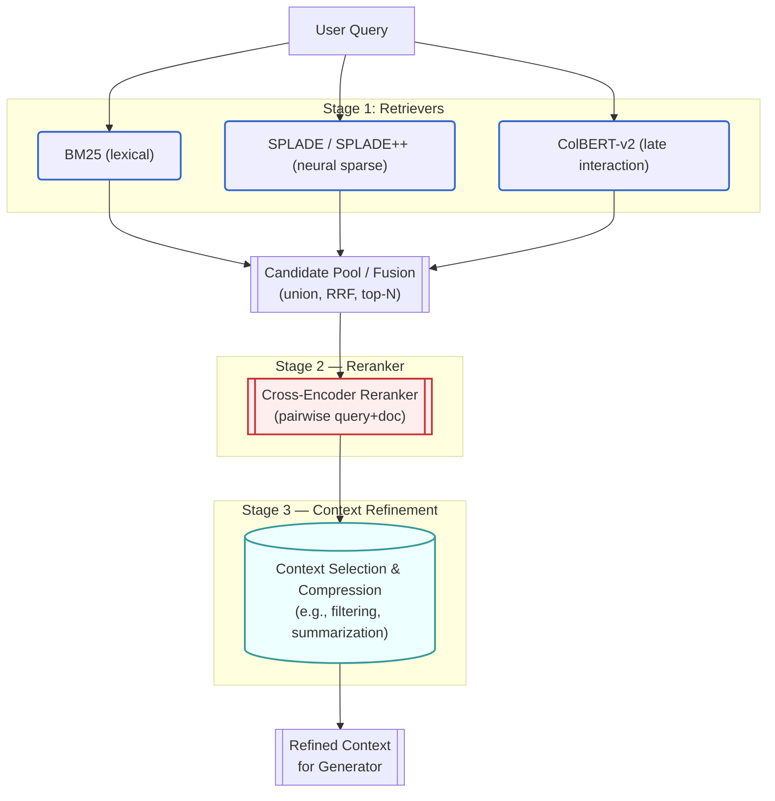
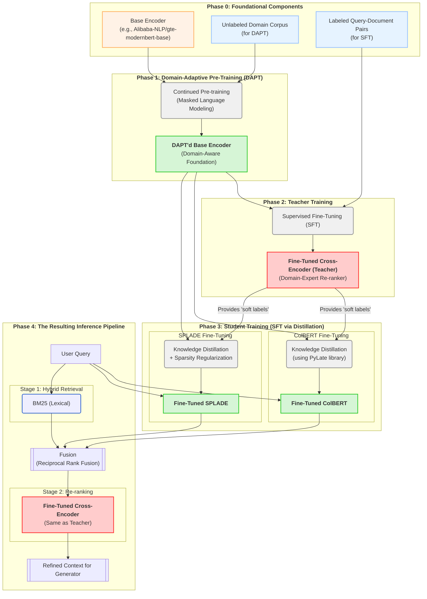

# Introduction

## **1. The Generalist's Dilemma: When State-of-the-Art Fails**

We are in the midst of a profound transformation in artificial intelligence. The advent of powerful, large-scale pre-trained models has unlocked capabilities that were once the domain of science fiction. Yet, for practitioners on the front lines, a critical challenge has emerged. Implementing high-performance AI systems, particularly the retrieval engine that powers modern Retrieval-Augmented Generation (RAG), becomes exceptionally difficult when the problem moves from the open web to the closed, jargon-filled world of a specialized domain.

In contexts like finance, law, medical research, or proprietary enterprise data, generic, "zero-shot" models often fail. Even the largest and most powerful generalist models, trained on trillions of words from the public internet, can falter when faced with a domain's unique vocabulary, its implicit rules, and its nuanced semantic relationships. They become "fluent parrots," capable of manipulating language but lacking a deep, grounded understanding of the subject matter. This leads to suboptimal, unreliable, and ultimately untrustworthy results, creating a significant barrier to the deployment of mission-critical AI.

## **2. The Specialist's Solution: The Two Pillars of High-Performance AI**

This course is built on a single, powerful thesis: the frontier of applied AI lies not in the pursuit of a single, ever-larger generalist model, but in the scientific and engineering discipline of **deeply adapting smaller, more focused models to specialized domains.**

Achieving state-of-the-art performance in these real-world scenarios requires a dual approach—a synthesis of a **smarter architecture** and a **deeper training methodology**. This codex is a comprehensive playbook for mastering both of these pillars, providing a clear path from theory to production-grade implementation.

## **3. Pillar 1: The Modern Retrieval Architecture**

The first step to building a high-performance system is to adopt a state-of-the-art architecture. Modern information retrieval is no longer a monolithic search box; it is a sophisticated, multi-stage "funnel" designed to surgically balance the competing demands of speed and precision.

The diagram below illustrates this best-practice architecture, a system designed to deliver the most relevant and concise context possible to a generative model.

This system operates as a three-stage funnel:

* **Stage 1: Hybrid Candidate Retrieval:** The process begins with a hybrid approach designed for high recall. By simultaneously leveraging multiple retrieval paradigms—classical lexical (BM25), learned sparse (SPLADE), and dense late-interaction (ColBERT)—we cast a wide and intelligent net. The ranked lists from these parallel retrievers are then fused (e.g., using Reciprocal Rank Fusion) to produce a single, robust candidate set that capitalizes on the unique strengths of each model.

* **Stage 2: Precision Reranking:** The focus then shifts from recall to precision. The top candidates are passed to a powerful **Cross-Encoder Reranker**. This model performs a deep, pairwise analysis of the query and each candidate document, allowing it to capture complex semantic nuances and produce a highly accurate final ordering.

* **Stage 3: Context Refinement:** The final stage intelligently selects, filters, and compresses the reranked passages to create a refined, noise-free context that is both sufficient and maximally relevant for the final generative model.

## **4. Pillar 2: The Domain-Specific Fine-Tuning Workflow**

A great architecture is a necessary but insufficient condition for success. To truly unlock state-of-the-art performance, the *components* of that architecture must be transformed from generalists into domain experts. This requires a rigorous, multi-phase training and fine-tuning workflow.

The diagram below details this scientific methodology, a process designed to adapt a powerful open-source base model into a suite of highly specialized retrieval components.

This workflow consists of two major parts: a training pipeline and the final inference pipeline.

* **Phase 1: Domain-Adaptive Pre-Training (DAPT):** This is the foundational step. We take a powerful, open-source base encoder and continue its pre-training on a large, unlabeled corpus of domain-specific text. The goal is to teach the model the unique language, vocabulary, and semantics of the target domain.

* **Phase 2: Teacher Training (SFT):** Using the new domain-aware encoder, we build and fine-tune a cross-encoder on a labeled dataset of query-document pairs. This process forges our most accurate "expert judge" or "Teacher" model, which will serve as our final reranker.

* **Phase 3: Student Training (Knowledge Distillation):** The expert Teacher model is too slow for first-stage retrieval. Therefore, we use its deep knowledge to "teach" our faster "student" models (ColBERT and SPLADE). The students are trained to mimic the nuanced relevance scores of the Teacher, effectively distilling its precision into their fast and scalable architectures.

This rigorous process results in a full suite of retrieval models that are expertly adapted to the target domain, ready for deployment in the final, high-performance inference pipeline.

## **5. The Journey Ahead: From Theory to Practice**

This course is a complete, end-to-end journey through the science and engineering of specialized retrieval. We will begin with the foundational theories that underpin modern search, from classical lexical algorithms to the deep learning models that power the semantic web. We will then dissect the specific architecture of each component in our state-of-the-art pipeline, from BM25 to ColBERT. Finally, we will provide a practical, hands-on guide to the advanced training and fine-tuning techniques—DAPT, SFT, and Knowledge Distillation—required to adapt these models and achieve state-of-the-art results on challenging, domain-specific data.

The ultimate goal of this codex is to provide you with a definitive playbook for building high-performance, specialized AI systems that are robust, reliable, and ready for real-world application.
