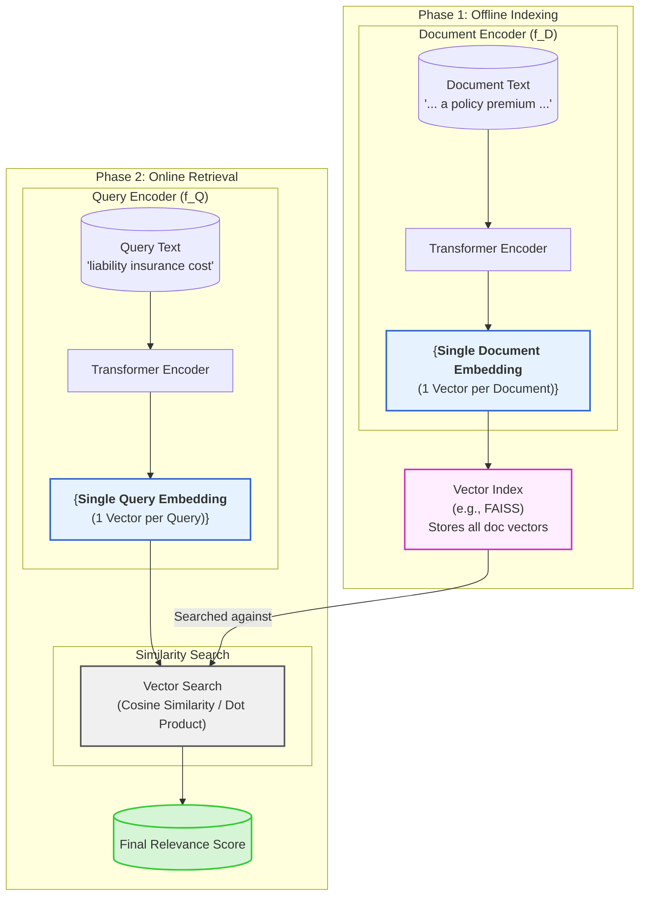
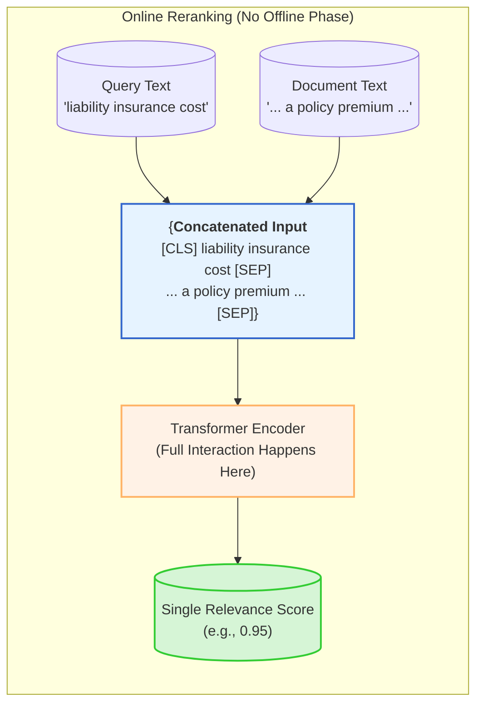
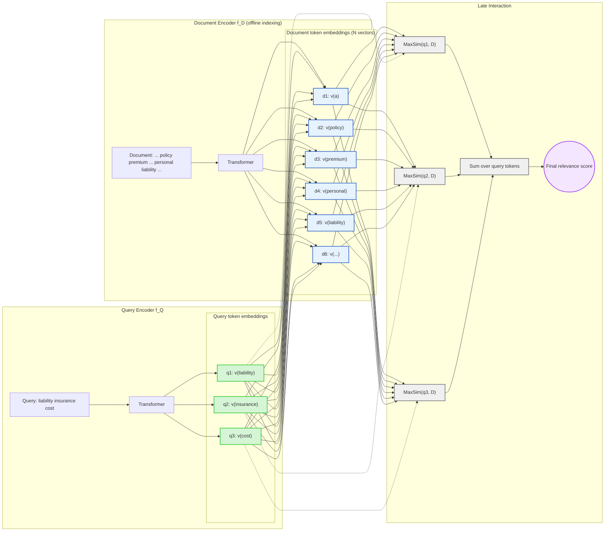

# The Modern Retriever: A Visual Guide

Having explored the individual components of our hybrid retrieval system—from the foundational bi-encoder to the powerful cross-encoder and the innovative ColBERT—it is now time to consolidate our understanding. The best way to grasp the fundamental trade-offs between these architectures is to see them side-by-side.

This chapter serves as a visual reference, presenting the architectural "DNA" of each of the three core neural retrieval paradigms. By comparing their data flows, we can build a clear and lasting intuition for how each model navigates the critical balance between retrieval speed and semantic precision.

## **1. The Bi-Encoder: The Scalable Workhorse**

The bi-encoder, or "two-tower" model, is the workhorse of scalable semantic search. Its design is predicated on a simple but powerful idea: maximize speed by performing the heaviest computational work (document encoding) offline. It compresses the meaning of each document into a single "gist" vector, allowing for an incredibly fast similarity search at query time.

* **Key Characteristics:**
  * **Architecture:** Two separate "towers" for query and document encoding.
  * **Interaction:** **None** during encoding. Interaction happens only at the very end via a single vector comparison.
  * **Representation:** A **single** embedding vector for each item (query or document).
  * **Key Trade-off:** Prioritizes **Speed and Scalability** over fine-grained precision.
  * **Primary Role:** High-recall, first-stage retrieval.

## **2. The Cross-Encoder: The Precision Specialist**

The cross-encoder sits at the opposite end of the spectrum. It is designed for one thing: maximum precision. By fusing the query and document into a single input *before* the Transformer sees them, it enables a deep, fully contextualized analysis. This power comes at the cost of speed, as there is no possibility for offline pre-computation.

* **Key Characteristics:**
  * **Architecture:** A **single** encoder tower that processes a combined input.
  * **Interaction:** **Full and immediate.** Every query token interacts with every document token through all layers of the Transformer.
  * **Representation:** N/A. It directly outputs a relevance score, not an independent vector representation.
  * **Key Trade-off:** Prioritizes **Maximum Precision** at the cost of massive computational overhead and speed.
  * **Primary Role:** High-precision, second-stage reranking.

## **3. ColBERT: The Fine-Grained Compromise**

ColBERT strikes a brilliant compromise between the two extremes. By breaking documents down into a "bag of vectors" (one for each token) and performing a "late" interaction at query time, it achieves a fine-grained level of matching that is far more precise than a bi-encoder, while remaining dramatically faster than a cross-encoder.

* **Key Characteristics:**
  * **Architecture:** Functionally a "two-tower" model.
  * **Interaction:** **Late.** Interaction happens *after* independent encoding, via token-level MaxSim operations.
  * **Representation:** A **bag of vectors** for each item (one vector per token).
  * **Key Trade-off:** A balanced compromise, offering **High Precision at a Manageable Speed**, but with a large storage footprint.
  * **Primary Role:** High-precision, first-stage retrieval.

### **Summary: A Side-by-Side Comparison**

This table provides a final, at-a-glance summary of the three architectures, highlighting their core differences.

| Feature | Bi-Encoder (Dense) | ColBERT (Late Interaction) | Cross-Encoder |
| :--- | :--- | :--- | :--- |
| **Architecture** | Two Towers | Two Towers | Single Tower |
| **Interaction Point** | Post-Encoding (Single Vector) | Post-Encoding (Token Vectors) | During Encoding (Full Text) |
| **Representation** | Single Vector | Bag of Vectors | N/A (Score) |
| **Key Trade-off**| **Speed** > Precision | Speed **≈** Precision | **Precision** > Speed |
| **Primary Role** | 1st Stage Retrieval (Recall) | 1st Stage Retrieval (Precision) | 2nd Stage Reranking |

Understanding the unique strengths and weaknesses of these three architectures is the key to designing a robust and effective hybrid retrieval pipeline. There is no single "best" model, only the right tool for the right stage of the job. By combining them, as we do in this course, we can build a system that achieves the best of all worlds.
