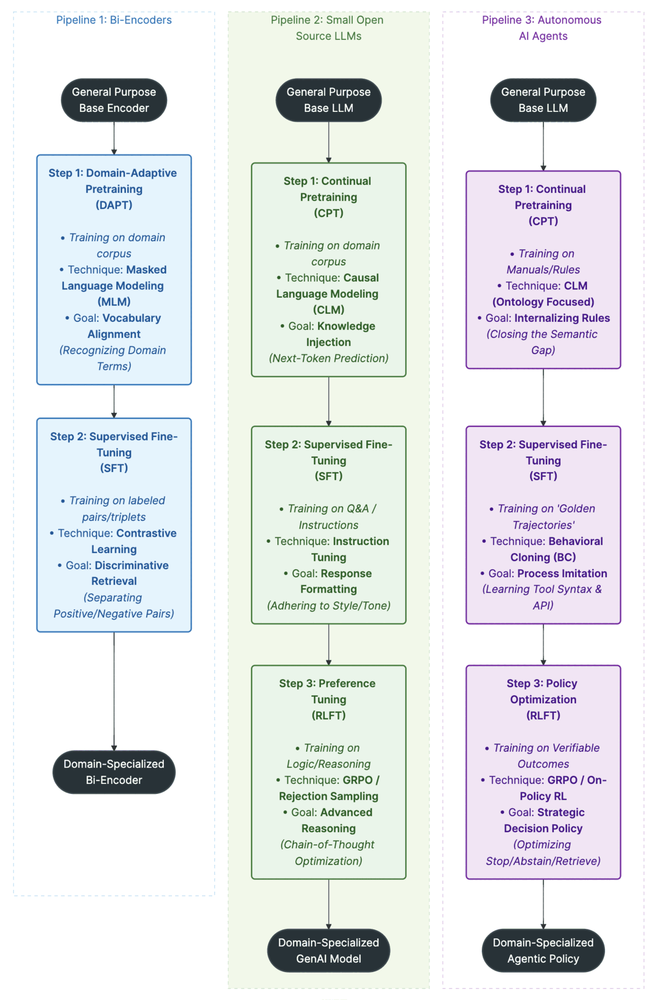

# The Three Pillars of Domain AI: Architectures and Training Pipelines

In the transition from generic foundation models to specialized enterprise solutions, "one size fits all" no longer applies. We define three distinct architectures required for a complete domain-specific ecosystem:

1. **Bi-Encoders:** The retrieval system (The "Eyes").
2. **Small Open Source LLMs:** The reasoning and generation engine (The "Brain").
3. **Autonomous AI Agents:** The decision-making policy (The "Hands").

While all three follow an `Adaptation` $\to$ `Specialization` $\to$ `Optimization` progression, the mathematical objectives and goals at each stage differ significantly.

## Stage 1: Domain Adaptation (DAPT / CPT)

**The Goal:** Internalizing the "Language" and "Environment."

Before a model can perform a task, it must understand the domain's vocabulary, ontology, and implicit rules. This stage bridges the **Semantic Gap** between public internet data and private enterprise corpora.

### Pipeline 1: Bi-Encoders (DAPT)

* **Technique:** **Masked Language Modeling (MLM).** The model hides random tokens in a sentence (e.g., "The patient presented with [MASK]...") and predicts them.
* **Goal:** **Vocabulary Alignment.** The encoder learns that "MI" in a clinical context means "Myocardial Infarction," not "Michigan" or "Mission Impossible." This ensures that embeddings for domain terms are mathematically distinct from general terms.

### Pipeline 2: Small LLMs (CPT)

* **Technique:** **Causal Language Modeling (CLM).** Next-token prediction on raw domain text.
* **Goal:** **Knowledge Injection.** The LLM memorizes facts, acronyms, and writing styles. It learns the statistical likelihood of sequences, ensuring it doesn't hallucinate plausible-sounding but incorrect expansions of domain abbreviations.

### Pipeline 3: AI Agents (CPT)

* **Technique:** **CLM (Ontology Focused).** Training on manuals, rulebooks, and procedure guides.
* **Goal:** **Internalizing Rules & Environment.** For an agent, this stage isn't just about facts; it is about learning the *dynamics* of the environment. By pre-training on a claims manual, the agent learns the implicit logic (e.g., "If Section A applies, Section B is void") before it ever attempts to use a tool.

## Stage 2: Supervised Fine-Tuning (SFT / BC)

**The Goal:** Learning the "Task" and "Trajectory."

Once the model speaks the language, we must teach it what to *do* with that language. This is where the pipelines diverge most radically in their technical approach.

### Pipeline 1: Bi-Encoders (SFT)

* **Technique:** **Contrastive Learning.** Training on triplets: *(Query, Positive Document, Negative Document)*.
* **Goal:** **Discriminative Retrieval.** The model learns to pull positive matches closer in vector space and push negatives away. It transforms from simply understanding words to understanding *relevance*.

### Pipeline 2: Small LLMs (SFT)

* **Technique:** **Instruction Tuning.** Training on *(Prompt, Response)* pairs.
* **Goal:** **Response Formatting.** The LLM learns to follow instructions (e.g., "Summarize in JSON"). It focuses on style, tone, and adherence to specific output schemas.

### Pipeline 3: AI Agents (SFT $\rightarrow$ Behavioral Cloning)

* **Technique:** **Behavioral Cloning (BC).**
* **Goal:** **Trajectory Following (Process Imitation).**
  * Unlike an LLM which learns to map $Input \rightarrow Output$, an agent must learn to map $State \rightarrow Action$.
  * We use **Golden Trajectories** - recorded logs of expert systems or humans solving a problem perfectly.
  * The model learns to mimic the expert's exact path: *Thought $\rightarrow$ Call Search Tool $\rightarrow$ Read Result $\rightarrow$ Call Calculator $\rightarrow$ Final Answer.* This mimics the syntax of tool usage and the logical flow of operations.

## Stage 3: Optimization & Policy Tuning (RLFT)

**The Goal:** Optimizing "Reasoning" and "Decisions."

SFT teaches the model *how* to perform a task. RLFT teaches the model *how well* to perform it, optimizing for specific metrics like accuracy, efficiency, and safety.

### Pipeline 1: Bi-Encoders (Usually Ends at SFT)

* *Note:* While advanced techniques exist, most enterprise bi-encoders are fully specialized after SFT. Further optimization usually happens at the re-ranking stage.

### Pipeline 2: Small LLMs (RLFT)

* **Technique:** **GRPO / Rejection Sampling.**
* **Goal:** **Advanced Reasoning (Chain-of-Thought).**
  * We generate multiple reasoning paths for a complex logic puzzle or extraction task.
  * We reward the paths that result in the correct answer.
  * The model learns to self-correct and think step-by-step to maximize the probability of a correct output.

### Pipeline 3: AI Agents (Policy Optimization)

* **Technique:** **Group Relative Policy Optimization (GRPO).**
* **Goal:** **Strategic Decision Policy.**
  * Here, we are not just optimizing for the correct answer, but for the **cost and safety** of getting there.
  * The policy is rewarded for:
        1. **Efficiency:** Using fewer steps/tools (lower latency/cost).
        2. **Calibration:** Successfully using the **STOP** or **ABSTAIN** actions when evidence is sufficient or insufficient.
  * Unlike Trajectory Following (SFT), which blindly mimics the expert, Policy Optimization allows the agent to discover *better* or *faster* ways to solve the problem than the human expert did.

## Illustrative Use Cases

### Use Case A: Legal Precedent Search (Bi-Encoder Pipeline)

* **Challenge:** A lawyer searches for "liability in slip and fall cases involving ice."
* **DAPT:** The encoder learns that "tort," "liability," and "negligence" are semantically related in legal corpora.
* **SFT:** The encoder learns that a document discussing "wet floor signs" (Positive) is relevant to the query, while a document about "ice cream manufacturing" (Negative) is not, even though they share the word "ice."

### Use Case B: Clinical Report Extraction (Small LLM Pipeline)

* **Challenge:** Convert a messy doctor's note into a structured JSON object.
* **CPT:** The LLM learns medical abbreviations ($Rx$, $Hx$, $Dx$).
* **SFT:** The LLM learns to strictly output JSON without conversational filler ("Here is the data...").
* **RLFT:** The LLM is trained via Rejection Sampling to double-check its own logic, ensuring it doesn't assign a medication to the wrong patient ID in complex, multi-patient notes.

### Use Case C: Automated Insurance Underwriting (AI Agent Pipeline)

* **Challenge:** Decide whether to approve a life insurance application based on a fragmented medical history.
* **CPT:** The Agent internalizes the "Underwriting Guidelines" manual, learning the rules for diabetic risk.
* **SFT (Behavioral Cloning):** The Agent is trained on 500 **Golden Trajectories** of senior underwriters. It learns the sequence: *Check Age $\rightarrow$ Query MIB Database $\rightarrow$ Check BMI $\rightarrow$ Decision.* It masters **Trajectory Following**.
* **RLFT (Policy Optimization):** The Agent is penalized for unnecessary database queries (saving cost). It learns a policy where it immediately **ABSTAINS** if the applicant is over 80 years old (because the guidelines say automatic decline), skipping the expensive database lookup entirely - a strategic efficiency the SFT model might have missed.
